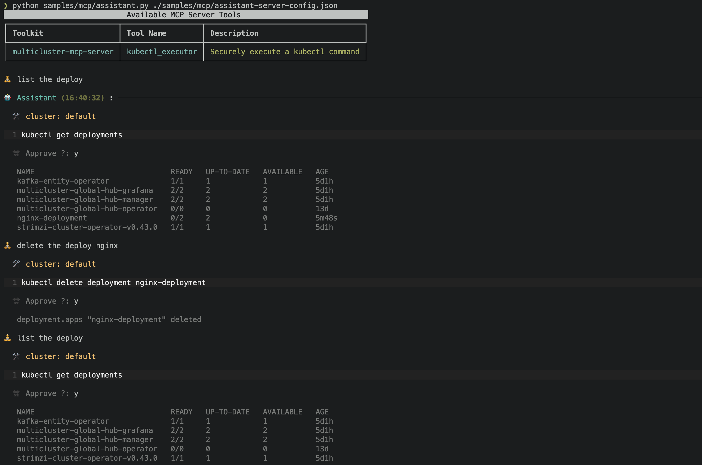

# Multicluster MCP server

The **Multi-Cluster MCP Server** provides a robust gateway for Generative AI (GenAI) systems to interact with multiple Kubernetes clusters through the Model Context Protocol (MCP). It facilitates comprehensive operations on Kubernetes resources, streamlined multi-cluster management, and delivered interactive cluster observability.

## **🚀 Features**

### 🛠 Kubernetes Cluster Operations

✅ Fully supports `kubectl` to interact with your cluster  

✅ Create, update, and list resources (Deployments, Pods, Services, etc.) 

<details>
<summary>Kubernetes Operations</summary>



</details>

### 🌍 Multi-Cluster Management (via Open Cluster Management)

✅ Access and manage resources across multiple Kubernetes clusters

<details>
<summary>Mutiple Kubernetes Operations</summary>

[](https://asciinema.org/a/706281)

</details>

❌ Interact with multi-cluster APIs, including Managed Clusters, Policies, Add-ons, and more  

### 📊 Cluster Observability

❌ Retrieve and analyze **metrics, logs, and alerts** from integrated clusters  

## **🛠 Installation**  

📌 **Note:** Ensure `kubectl` is installed. By default, the tool uses the **`KUBECONFIG`** environment variable to access the cluster. In a multi-cluster setup, it treats the configured cluster as the **hub cluster**, accessing others through it.

To use with Claude Desktop, add the server config:

On MacOS: `~/Library/Application Support/Claude/claude_desktop_config.json`
On Windows: `%APPDATA%/Claude/claude_desktop_config.json`

```json
{
  "mcpServers": {
    "y": {
      "command": "/path/to/multicluster-mcp-server/build/index.js"
    }
  }
}
```

## License

This project is licensed under the [MIT License](LICENSE).
